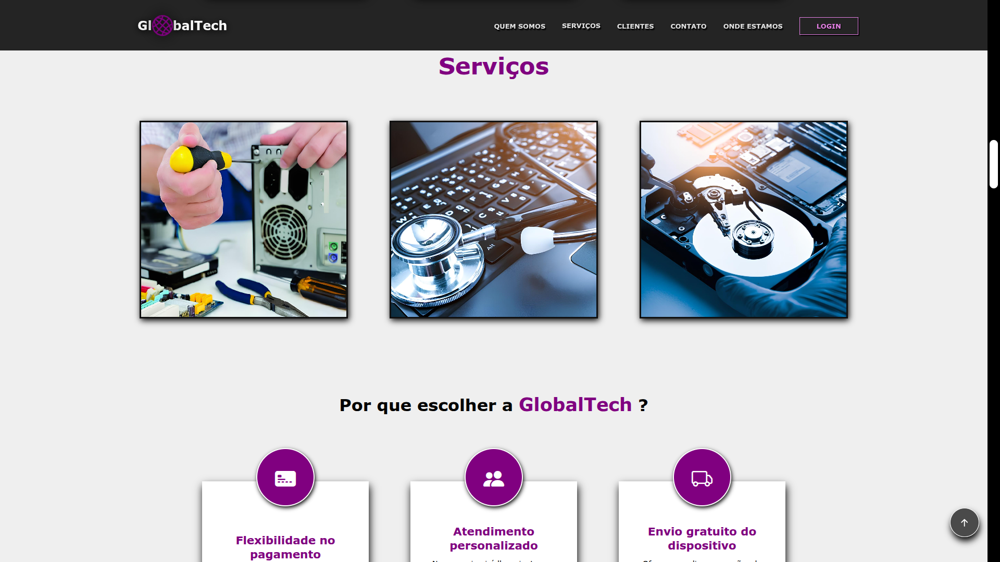
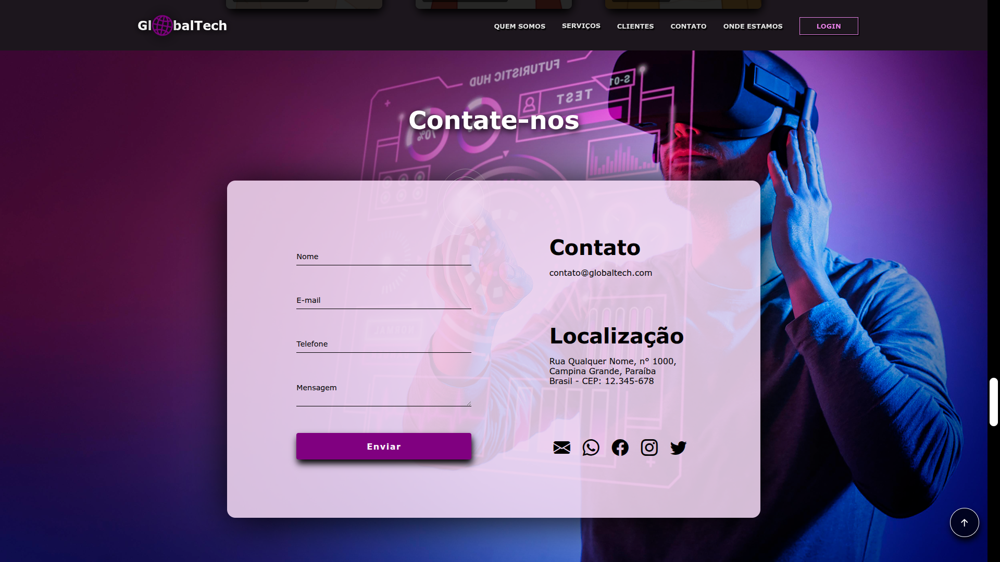
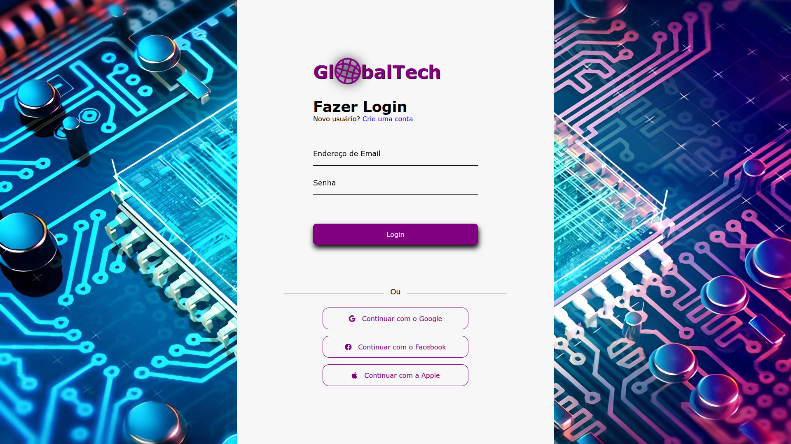

# 🌐 GlobalTech
Este projeto foi desenvolvido como parte da disciplina **Desenvolvimento Web** no **IFPB**. O objetivo era criar um site estático para promover a marca pessoal e os serviços de um profissional da área de **Tecnologia da Informação**, aplicando os conhecimentos de **HTML, CSS e JavaScript**.

---
## 📄 Sobre o Projeto
O site funciona como um cartão de visita digital para um profissional da área de TI. Ele apresenta informações sobre o profissional, os serviços oferecidos, um portfólio de projetos e canais de contato.

### 📌 Conteúdo
O site contém as seguintes seções principais:

* **Quem Somos**: Apresenta missão, história, valores e serviços.
* **Serviços**: Cards detalhando os serviços de manutenção, reparos e recuperação de dados.
* **Diferenciais**: Vantagens da empresa para o cliente.
* **Seções detalhadas**: Explicações específicas para cada tipo de serviço.
* **Contato**: Formulário de contato, com informações e redes sociais.

---
## 🗓️ Histórico de Desenvolvimento
> Este projeto foi originalmente iniciado em **2022**, durante o meu **ensino médio**. Ao longo do tempo, ele passou por diversas atualizações informais e commits experimentais, com mensagens pouco descritivas e algumas implementações que não seguiam uma linha de organização clara.<br><br>
> Por esse motivo, **decidi reiniciar este repositório** a partir de uma versão consolidada e atualizada, mantendo o que há de melhor do projeto original, mas com uma **estrutura mais limpa**, **boas práticas aplicadas** e um **histórico de commits mais compreensível**.<br>

🔄 **Este repositório representa uma "release limpa" do projeto**, mas o período real de desenvolvimento começou em **2022**.

---
## 🛠️ Tecnologias Utilizadas
- HTML5 (estruturação)
- CSS3 (estilização e efeitos básicos)
- JavaScript (interações e scroll suave)
- Media Queries (responsividade)

## 📁 Estrutura de Diretórios
```
global-tech/
├── index.html               # Página principal
├── pages/
│   └── login.html           # Página de login
│   └── termo.html           # Página de termos
│   └── privacidade.html     # Página de privacidades
├── assets/
│   ├── img/                 # Imagens usadas no site
│   ├── scripts/             # Scrips em JS para interações do site (animações, responsividade, scroll suave)
│   └── style/
│       ├── base/            # Estilos básicos
│       ├── layout/          # Estilos de header, main, footer
│       ├── components/      # Estilos de componentes reutilizáveis (sliders, formulários)
│       └── pages/           # Estilos específicos para páginas (login.css)
│       └── utils/           # Animações, media queries
├── README.md                # Este arquivo
```
---
## 📱 Responsividade
O site foi projetado para funcionar bem em **dispositivos móveis**, **tablets** e **desktops**, utilizando técnicas de design responsivo com media queries.

## 🚀 Como Visualizar
Você pode abrir o arquivo `index.html` no seu navegador ou, se preferir, [**visualizar online via GitHub Pages**](https://vitoriabarbosa.github.io/global-tech/).

## 📚 Aprendizados
Durante o desenvolvimento deste projeto, foram aplicados conceitos fundamentais como:

- Estruturação semântica com HTML
- Estilização com CSS (cores, fontes, layout e efeitos)
- Adição de interações simples com JavaScript
- Acessibilidade e navegação amigável
- Organização modular de arquivos

---
## 📸 Demonstração






---
## 📝 Licença
Este projeto é licenciado sob a Licença MIT - veja o arquivo [LICENSE](LICENSE.md) para mais detalhes.

👩‍💻 Projeto acadêmico desenvolvido no Instituto Federal da Paraíba – IFPB, 2022.
